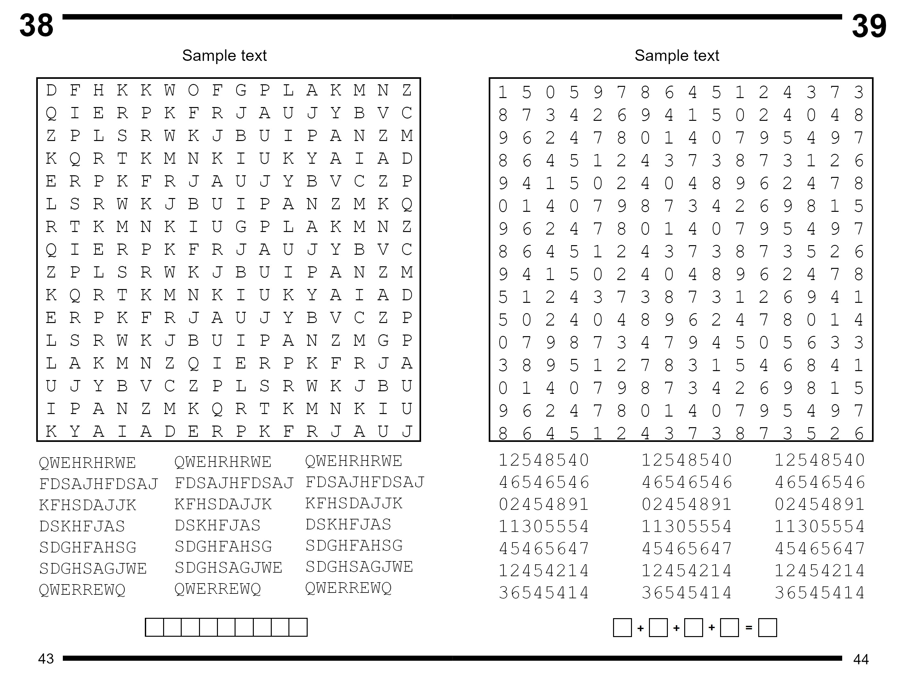

# Faster-RCNN word-search puzzle semantic element detection model

This repository contains 3 Faster-RCNN based fine tuned models for semantic detection of word-search type puzzle elements, such as:
- PUZZLE
- WORDLIST
- OTHER

## Datasets
The datasets used to train this model is from copyrighted material, thus it will not be published, though I made a copy of how an image used for training from the standard dataset looks.



There is no example of how the non-standard crossout puzzles look.

There were 6 datasets in total:
- Standard training (8 images)
- Standard validation (4 images)
- Standard testing (10 images)
- Non-standard training (8 images)
- Non-standard validation (4 images)
- Non-standard testing (10 images)

Standard datasets were made up of only images similar to the one shown before, while the non-standard one had some non-standard images. Standard and non-standard counterparts have overlaping images, but training/validation/testing ones do not overlap in any way.

The standard datasets contained only the standard type of image as shown previously. Non-standard datasets differed from their counterparts:
- Training dataset exchanged 4 standard images to 4 non-standard images
- Validation dataset exchanged 2 standard images to 2 non-standard images
- Testing dataset exchanged 4 standard images to 4 non-standard images

## Models

### ST (stand.pty)
This model was trained using the standard training dataset.

### ST_TR (stand_train.pty)
This model was trained using the standard training dataset. The only difference from `stand.pty` is that it was validated/tested using the non-standard datasets.

### NO_ST (non_stand.pty)
This model was trained using the non-standard training dataset.

## Setting up
To pull this repository, use

```bash
git clone https://github.com/d-pilipavicius/FASTER-RCNN-puzzle-segmentation.git
```

This project depends on these packages, use
```bash
pip install torch torchvision albumentations torchmetrics[detection]
```

Or if you want to run the model using GPU and use conda environment manager, create a conda python environment, activate it and run
```bash
conda install pytorch torchvision pytorch-cuda=11.8 -c pytorch -c nvidia
pip install albumentations torchmetrics[detection]
```

## Running the models
After cloning the repo, cd into the directory
```bash
cd FASTER-RCNN-puzzle-segmentation
```

And run
```bash
python src/main.py run SETUP_NAME IMAGE_FILEPATH [OUTPUT_FILENAME]
```

Select ST, ST_TR or NO_ST in place of SETUP_NAME. Output file is an image, if left unfilled, it will default to `./output.png`.

For example, to use NO_ST model with the given image, run
```bash
python src/main.py run NO_ST ./src/data/img/exmpl.jpg
```

## Testing models
To test the model metrics with a dataset, modify or add a setup in `setup.json`.
```json
{
  "setup": [
    {
      "name": "SETUP_NAME",
      "model": "model.pty",
      "test": "filename.txt"
    }
  ]
}
```
File listed under "test" should be placed in the `./src/data/ground` and should contain a list of images, that are present inside the `./src/data/img` folder (see `./src/data/ground/Test_S.txt` as reference) which will be used for testing. The used images should be listed inside `./src/data/ground/Ground_truth.csv` with their bounding boxes. To calculate the scale easier, use the `./Ground_truth.xlsx` and move the calculated info to `Ground_truth.csv` file.

"model" field should contain a filename for the model used in this setup under `./src` folder. This model will be used for evaluation.

To evaluate under any setup, run

```bash
python src/main.py test SETUP_NAME
```

## Training models
`WARNING!` Running the training command can overwrite already existing models.

To train the model with a dataset, modify or add a setup in `setup.json`.
```json
{
  "setup": [
    {
      "name": "SETUP_NAME",
      "model": "model.pty",
      "train": "filename.txt",
      "valid": "filename.txt"
    }
  ]
}
```

Setup the files the same way as described in `Testing models`.

To train under any setup, run

```bash
python src/main.py train SETUP_NAME
```